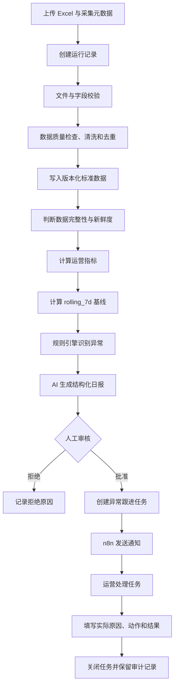
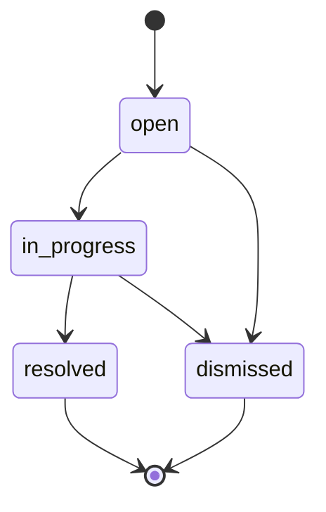

# 电商运营日报与异常处置自动化——需求规格说明书

| 文档属性 | 内容 |
| --- | --- |
| 文档版本 | V1.0 |
| 产品版本 | V1 |
| 文档状态 | 基线需求 |
| 更新日期 | 2026-09-26 |
| 适用项目 | Enterprise AI Automation |

## 1. 文档目的

本文档定义“电商运营日报与异常处置自动化”V1 的业务范围、数据口径、功能需求、状态规则、接口边界、验收标准和测试范围，作为产品设计、后端开发、n8n 编排、AI 评测和项目验收的共同依据。

## 2. 项目概述

### 2.1 项目定义

系统每天导入店铺经营数据，自动完成数据校验、清洗、标准化、指标计算、异常识别和 AI 日报生成。报告经人工审核后发送通知，并为需要处理的异常建立任务，持续记录负责人、实际原因、处理动作和处理结果。

异常预警是流程中的一个环节。完整业务目标是让异常从“被发现”走到“已处理且可追溯”。

### 2.2 产品定位

本项目定位为：

> Workflow Automation + AI-assisted Analysis（工作流自动化与 AI 辅助分析）

核心经营数字由确定性程序计算，异常由版本化规则判定。AI 负责基于已知事实生成摘要、原因假设和行动建议，不负责计算核心指标，也不直接执行调价、调预算、上下架等高风险动作。

### 2.3 业务目标

- 降低运营人员每天合并、清洗和核对多张报表的重复劳动。
- 统一 GMV、转化率、客单价、ROAS、退款和库存指标的计算口径。
- 通过可配置规则及时发现经营异常和数据质量问题。
- 生成结构稳定、数字可追溯的运营日报。
- 通过人工审核控制 AI 解释和规则误报风险。
- 防止重复处理、重复生成报告和重复通知。
- 为异常分配负责人和截止时间，保存完整处置记录。

### 2.4 成功标准

- 能从符合模板的 Excel 稳定生成标准化数据和正确指标。
- 能识别测试数据集中预先植入的已知异常。
- AI 报告中的数字全部来自系统提供的事实数据。
- AI 不将未经证实的原因写成事实。
- 未审核的报告无法发送，审核通过的同一报告最多成功通知一次。
- 任一异常都能查询当前处理状态、负责人、实际原因和处理结果。
- 数据修订后能够生成新版本，旧版本不被静默覆盖。

## 3. 用户与职责

| 用户角色 | 主要职责 |
| --- | --- |
| 店铺运营 | 查看整体经营日报，处理店铺经营异常 |
| 商品运营 | 处理 SKU 销售、库存和商品状态异常 |
| 广告投放运营 | 处理广告消耗、归因收入和 ROAS 异常 |
| 运营负责人 | 审核日报，确认重大异常和处理优先级，跟踪闭环 |
| 系统管理员/开发者 | 维护配置、规则版本、外部集成和运行问题 |

V1 不实现完整的账号、角色和权限系统。演示环境可通过预设角色或接口参数模拟上述职责，但审计记录必须保留操作者标识。

## 4. V1 范围

### 4.1 范围约束

| 项目 | V1 约束 |
| --- | --- |
| 店铺数量 | 单店 |
| 数据粒度 | 每日 |
| 数据来源 | 合成或脱敏 Excel |
| 初始历史数据 | 约 60 天 |
| 日常增量 | 每天追加 1 天，可修订既有日期 |
| SKU 数量 | 测试数据约 30 个 |
| 币种 | 人民币 CNY |
| 默认基线 | 前 7 个有效日平均值，`rolling_7d` |
| 通知方式 | 邮件或企业微信机器人，V1 仅启用一种 |
| 审核方式 | 所有报告发送前均需人工审核 |
| 执行频率 | 每天一次，允许人工补跑和修订重跑 |
| 前端 | 不开发独立前端，通过 OpenAPI 文档和 n8n 演示 |

### 4.2 V1 不包含

- 淘宝、京东、抖音等真实平台 API 接入。
- 分钟级实时监控。
- 自动改价、自动调整广告预算、自动上下架商品。
- 复杂销量预测和自动补货决策。
- 多店铺、多租户和完整权限系统。
- 前端数据大屏。
- 开放式自主 Agent。
- 同时接入多个通知平台。
- 按订单原始销售日期计算的订单批次退款率。
- 同星期、同比、环比、活动期等高级基线策略。

## 5. 术语与口径

| 术语 | 定义 |
| --- | --- |
| 业务日期 `biz_date` | 指标所属的自然日，不得晚于系统当前业务日期 |
| 数据采集时间 `data_collected_at` | 数据从来源系统导出或汇总完成的时间，包含时区 |
| 数据状态 `data_status` | `preliminary` 表示仍可能变化，`final` 表示已稳定 |
| 有效日 | 数据校验通过、目标指标所需字段完整且未被排除的历史日期 |
| 数据集版本 `dataset_version` | 同一店铺、同一业务日期范围的数据每次有效修订版本 |
| 报告版本 `report_version` | 基于某个数据集版本生成的不可变报告版本 |
| 基线策略 `baseline_strategy` | 用于比较当前指标的历史基准算法；V1 为 `rolling_7d` |
| 幂等提交 | 相同幂等键和相同请求内容的重复请求，返回已有结果且不重复执行 |
| 修订重跑 | 同一业务日期的数据内容发生变化后，以新版本重新计算并保留版本关系 |
| P1/P2/P3 | 异常优先级，P1 最高，P3 最低 |

## 6. 总体业务流程



技术运行状态、报告审核状态、通知状态和任务状态分别保存，不合并成一个状态字段。

## 7. 输入数据需求

### 7.1 上传要求

- 上传格式必须为 `.xlsx`。
- 文件必须包含 `store_daily` 和 `sku_daily` 两个 Sheet。
- 上传请求必须携带 `Idempotency-Key`。
- 上传请求必须提供 `data_collected_at` 和 `data_status`，作为本批数据元信息。
- `data_collected_at` 必须是包含时区的 ISO 8601 时间。
- `data_status` 只允许 `preliminary` 或 `final`。
- 文件大小上限应通过配置提供；V1 默认建议不超过 20 MB。
- 系统必须计算文件内容摘要，用于识别完全相同的数据提交。
- 初次历史导入约 60 天；日常文件通常包含一天数据，但系统不得依赖这一假设。

### 7.2 `store_daily` Sheet

唯一键：`store_id + biz_date`

| 字段 | 类型 | 必填 | 校验规则 |
| --- | --- | --- | --- |
| `biz_date` | date | 是 | 合法日期，不得为未来日期 |
| `store_id` | string | 是 | 去除首尾空格后非空 |
| `visitors` | integer | 是 | 非负整数 |
| `orders` | integer | 是 | 非负整数，原则上不得大于 `visitors`；违反时标记数据质量异常 |
| `gmv` | decimal | 是 | 非负金额，按人民币两位小数处理 |
| `ad_spend` | decimal | 是 | 非负金额 |
| `ad_attributed_revenue` | decimal | 是 | 非负金额 |
| `refund_amount` | decimal | 是 | 非负金额 |

### 7.3 `sku_daily` Sheet

唯一键：`store_id + sku_id + biz_date`

| 字段 | 类型 | 必填 | 校验规则 |
| --- | --- | --- | --- |
| `biz_date` | date | 是 | 合法日期，不得为未来日期 |
| `store_id` | string | 是 | 必须与本次导入店铺一致 |
| `sku_id` | string | 是 | 去除首尾空格后非空 |
| `sku_name` | string | 否 | 为空时保留 `null`，不得生成虚构名称 |
| `is_core_sku` | boolean | 是 | 接受规范布尔值；其他表示需明确转换或报错 |
| `sales_quantity` | integer | 是 | 非负整数 |
| `sales_amount` | decimal | 是 | 非负金额 |
| `stock_quantity` | integer | 是 | 非负整数 |
| `refund_quantity` | integer | 是 | 非负整数 |

### 7.4 数据校验和清洗

系统必须按以下顺序处理：

1. 校验扩展名、文件可读取性、Sheet 名称和文件大小。
2. 校验必填列、列名和基础类型。
3. 标准化日期、布尔值、字符串空格和金额精度。
4. 校验非负值、业务日期和唯一键。
5. 检查跨 Sheet 的 `store_id` 和日期范围是否一致。
6. 生成数据质量问题列表，包含 Sheet、行号、字段、错误代码和可读说明。
7. 阻断性错误存在时不写入业务事实表；运行记录和错误详情仍需保存。

同一文件内出现重复唯一键时：

- 内容完全相同：只保留一条，并记录去重数量。
- 内容不一致：视为阻断性错误，要求修正源文件。

### 7.5 数据新鲜度规则

- 所有标准化记录必须关联 `data_collected_at` 和 `data_status`。
- `preliminary` 数据生成的报告和异常必须显式标记为“初步数据”。
- 广告数据为 `preliminary` 时，ROAS 异常最高不得升级为 P1，应标记 `data_pending` 供人工判断。
- 后续导入 `final` 数据或修订数据时，必须生成新数据集版本并允许重跑。

## 8. 指标计算需求

指标由确定性代码计算，并保存数值、计算日期、数据集版本和公式版本。AI 不得自行重新计算这些指标。

| 指标 | 字段名 | 公式 | 分母为 0 时 |
| --- | --- | --- | --- |
| GMV | `gmv` | 输入值 | 不适用 |
| 转化率 | `conversion_rate` | `orders / visitors` | `null` |
| 客单价 | `average_order_value` | `gmv / orders` | `null` |
| 广告投入产出比 | `roas` | `ad_attributed_revenue / ad_spend` | `null` |
| 当日退款金额率 | `daily_refund_amount_rate` | `refund_amount / gmv` | `null` |
| SKU 库存可售天数 | `days_of_inventory` | `stock_quantity / 前7个有效日平均销量` | `null` |

规则说明：

- 比率类指标内部使用高精度小数存储，展示时再格式化。
- 分母为零时不得返回无穷大或伪造为 0，必须返回 `null` 并附带数据质量说明。
- `daily_refund_amount_rate` 反映“当日发生退款金额与当日 GMV 的比例”。退款可能来自历史订单，因此报告不得表述为“当日销售商品的最终退款率”。
- 计算库存可售天数时，平均销量只使用该 SKU 前 7 个有效日，不包含当前日。
- 历史平均销量为 0 时，库存可售天数返回 `null`；当库存同时为 0 时可另行命中“无库存且无销量基线”数据质量提示。

## 9. 基线计算需求

### 9.1 V1 默认策略

`baseline_strategy = rolling_7d`

- 基线取当前业务日期之前最近 7 个有效日的算术平均值。
- 当前日不得参与自身基线计算。
- 历史记录必须来自同一店铺；SKU 指标还必须来自同一 SKU。
- 少于 7 个有效日时，不进行趋势异常判定，返回 `insufficient_data`。
- 报告与异常记录必须保存 `baseline_strategy` 和参与计算的日期范围。

### 9.2 后续扩展

数据模型应允许后续增加 `same_weekday_4w`、`previous_week`、`previous_month` 和 `campaign_baseline`，V1 不实现这些策略。

## 10. 异常识别需求

### 10.1 基本原则

- 异常是否成立由可配置、可版本化的确定性规则决定。
- 每条异常必须保存当前值、基线值、变化幅度、证据、优先级、规则版本和数据状态。
- AI 可以解释异常，但不得新增规则未命中的“已确认异常”。
- 同一数据集版本和同一规则版本重复执行，不得重复创建相同异常。

### 10.2 V1 默认规则

| 规则编号 | 条件 | 默认优先级 | 负责人角色 |
| --- | --- | --- | --- |
| `GMV_DROP` | GMV 较基线下降至少 20% | P2 | 店铺运营 |
| `CONVERSION_DROP` | 转化率较基线下降至少 20% | P2 | 店铺运营 |
| `ROAS_DROP` | ROAS 较基线下降至少 20% | P2 | 广告投放运营 |
| `REFUND_RATE_RISE` | 当日退款金额率较基线高至少 2 个百分点 | P2 | 店铺运营 |
| `CORE_SKU_LOW_STOCK` | 核心 SKU 库存可售天数少于 3 天 | P1 | 商品运营 |
| `AD_SPEND_INEFFICIENT` | 广告消耗上涨但广告归因收入未同步上涨 | P2 | 广告投放运营 |
| `DATA_QUALITY` | 数据缺失、格式错误或明显不合理 | 根据影响定级 | 系统管理员/店铺运营 |

“广告消耗上涨但广告归因收入未同步上涨”的 V1 默认判定为：`ad_spend` 较基线上涨至少 20%，且 `ad_attributed_revenue` 增幅小于 5% 或为负。阈值必须可配置。

### 10.3 异常输出

```json
{
  "rule_code": "CONVERSION_DROP",
  "metric": "conversion_rate",
  "current": 0.021,
  "baseline": 0.030,
  "change_pct": -30.0,
  "severity": "P2",
  "evidence": "访客数基本稳定，订单量较基线明显下降",
  "data_status": "final",
  "baseline_strategy": "rolling_7d",
  "rule_version": "v1"
}
```

其中百分比变化使用：`(current - baseline) / baseline × 100%`。基线为 0 时不得计算变化率，应返回 `null` 并由专门规则判断。

## 11. AI 日报需求

### 11.1 AI 输入

AI 只接收经过程序验证和计算的结构化数据：

- 店铺、业务日期、数据状态和版本信息。
- 当日经营指标及历史基线。
- 已命中的异常及其规则证据。
- 重点 SKU 和库存信息。
- 数据质量问题。

AI 不直接接收原始 Excel 作为事实判断来源。

### 11.2 AI 输出结构

```json
{
  "overview": "今日经营概况",
  "key_findings": [],
  "hypotheses": [],
  "suggested_actions": [],
  "management_summary": "发送给运营负责人的简短摘要"
}
```

每个原因假设至少包含：关联异常、假设内容、依据、待验证证据。每个行动建议至少包含：关联异常、建议动作、建议负责人角色和紧急程度。

### 11.3 事实约束

- 所有数字必须来自系统提供的指标或异常数据。
- 不允许 AI 自行计算核心指标或改变规则结论。
- 不允许虚构活动、竞品、商品页面变化或外部市场原因。
- 未确认原因必须使用“可能”“需核查”等表述。
- 数据不足时必须明确说明，不得补全或猜测。
- 输出必须通过 Pydantic Schema 校验。
- Schema 校验失败或调用超时时允许按配置重试。
- 每次调用保存模型标识、提示词版本、输入摘要、输出、耗时和错误信息。
- AI 调用失败时，已入库的指标和异常仍可查询，不得回滚或丢失。

## 12. 人工审核需求

- 报告生成后进入 `pending` 状态。
- 审核人可以执行 `approve` 或 `reject`，并填写审核意见。
- V1 中所有报告必须批准后才能创建对外通知。
- 拒绝时必须填写原因；拒绝的报告不得发送。
- 审核动作必须记录操作者、时间、意见和审核前报告版本。
- 已审核报告内容不可原地修改；数据或内容发生变化时应生成新报告版本并重新审核。

V1 统一审核是降低 AI 错误解释和异常规则误报风险的安全措施。后续版本可按异常等级配置自动发送策略。

## 13. 任务跟进需求

### 13.1 任务创建

批准报告后，每条需要人工处理的异常可以创建一条任务。任务至少包含：

```json
{
  "anomaly_id": "anomaly_123",
  "owner_role": "商品运营",
  "priority": "P1",
  "action": "检查核心 SKU 库存及商品状态",
  "due_at": "2026-09-27T18:00:00+08:00",
  "status": "open"
}
```

- 同一异常在同一报告版本下最多创建一个有效任务。
- P1 默认截止时间为创建后 24 小时，P2 为 48 小时，P3 为 72 小时；具体值应可配置。
- 任务创建失败不得阻止其他任务落库，失败项需记录并支持安全重试。

### 13.2 任务状态



关闭任务时：

- `resolved` 必须填写实际原因、处理动作、处理结果和完成时间。
- `dismissed` 必须填写驳回/无需处理原因。
- 所有状态变化必须保存操作者和时间。

## 14. 通知需求

- V1 通过 n8n 接入邮件或企业微信机器人中的一种渠道。
- 通知内容包括业务日期、店铺、数据状态、重要异常、当前值、基线、变化、建议动作、负责人、任务或报告标识。
- 通知请求必须使用报告版本和渠道组成唯一幂等标识。
- 同一报告版本在同一渠道最多存在一次成功发送记录。
- 通知失败必须保存错误详情，并允许安全重试。
- 重试成功后不得因旧失败记录再次发送。
- n8n 回调必须校验关联标识，并能够处理重复回调。

## 15. 幂等、修订与重跑

### 15.1 重复提交

- 相同 `Idempotency-Key`、相同文件摘要和相同上传元数据：返回原运行记录，不重复清洗、计算、生成报告或通知。
- 相同 `Idempotency-Key` 但请求内容不同：拒绝请求并返回冲突错误。
- 不同幂等键但文件摘要和元数据完全相同：系统应识别为重复数据并返回已有数据集信息，避免重复事实记录。

### 15.2 数据修订

同一店铺和业务日期的数据内容发生变化时，视为修订：

- 创建新的 `dataset_version`，旧版本保留且不可覆盖。
- 新运行记录保存 `rerun_of_run_id` 或被修订的数据集标识。
- 基于新数据集重新计算指标、基线和异常。
- 生成新的 `report_version`，不得覆盖旧报告。
- 新报告必须重新审核；旧报告和旧通知保留用于审计。
- 查询接口应能返回当前有效版本及完整版本链。

## 16. 状态与运行记录

### 16.1 工作流运行状态

```text
accepted → running → succeeded
                   ↘ failed
                   ↘ cancelled
                   ↘ timed_out
```

工作流运行状态描述技术处理结果。报告审核、通知和任务处理可能在技术处理完成后继续，因此分别使用独立状态。

### 16.2 报告审核状态

```text
pending → approved
        ↘ rejected
```

### 16.3 通知状态

```text
pending → sent
        ↘ failed → pending（重试）
```

### 16.4 工作流步骤

系统至少记录以下步骤：

```text
import_data
validate_data
clean_data
persist_data
calculate_metrics
calculate_baseline
detect_anomalies
generate_report
```

人工审核、创建任务和发送通知作为关联领域事件记录，也可以写入步骤日志：

```text
review_report
create_tasks
send_notification
```

每一步必须记录状态、开始/结束时间、输入摘要、输出摘要、重试次数和错误信息。日志使用 `run_id` 关联整条链路。

## 17. API 需求

### 17.1 计划接口

```http
POST  /api/v1/ops-runs/import
GET   /api/v1/ops-runs/{run_id}
GET   /api/v1/ops-runs/{run_id}/steps

GET   /api/v1/ops-reports/{report_id}
GET   /api/v1/ops-reports/{report_id}/versions
POST  /api/v1/ops-reports/{report_id}/review

GET   /api/v1/ops-anomalies
GET   /api/v1/ops-tasks/{task_id}
PATCH /api/v1/ops-tasks/{task_id}

POST  /api/v1/integrations/n8n/callback
```

### 17.2 通用接口规则

- 上传首次成功创建返回 HTTP `201`。
- 幂等重放返回原记录和 HTTP `200`，并提供 `Idempotent-Replay: true`。
- 同一幂等键对应不同请求返回 HTTP `409`。
- 参数错误返回 HTTP `422`，错误信息应定位到字段；Excel 行数据错误还应包含 Sheet 和行号。
- 资源不存在返回 HTTP `404`。
- 所有响应包含可追踪的 `run_id` 或请求追踪标识。

现有 `/workflow/run`、`workflow_run`、`workflow_step_run` 和幂等机制作为技术基础保留，但不是最终电商业务接口。

## 18. 数据模型范围

### 18.1 保留表

- `workflow_run`：一次技术工作流运行及版本关系。
- `workflow_step_run`：步骤执行、重试和错误记录。

### 18.2 计划新增表

| 表 | 主要职责 |
| --- | --- |
| `ops_dataset` | 导入批次、采集时间、数据状态、摘要和数据集版本 |
| `store_daily_metric` | 店铺日级原始事实和确定性指标 |
| `sku_daily_metric` | SKU 日级原始事实和确定性指标 |
| `ops_anomaly` | 规则命中结果、证据、优先级和规则版本 |
| `ops_report` | AI 报告、模型/提示词版本、数据集版本和审核状态 |
| `ops_task` | 异常负责人、截止时间、状态和处置结果 |
| `notification_delivery` | 通知渠道、幂等标识、发送状态和重试记录 |

关键约束：

- 指标事实必须关联数据集版本。
- 报告必须关联生成它的数据集版本和异常集合。
- 异常必须关联指标事实和规则版本。
- 任务必须关联异常和报告版本。
- 通知必须关联已批准报告版本。

具体字段、索引和外键在数据库设计文档中进一步定义，并统一由 Alembic 管理。

## 19. 非功能需求

### 19.1 正确性与一致性

- 指标计算对验收样本的正确率必须为 100%。
- 数据导入、事实写入和版本创建必须在一致的事务边界内完成。
- 外部 AI 或通知服务失败不得导致已计算事实丢失。

### 19.2 性能

- 10,000 行级别的测试文件应能在开发环境的合理时间内完成确定性处理。
- V1 验收目标：不含 AI 和人工等待时间，10,000 行文件在 60 秒内完成校验、清洗、入库、指标和规则计算。
- 查询单个运行、报告或任务的接口在正常开发环境下目标响应时间不超过 2 秒。

### 19.3 安全与隐私

- 不采集或保存客户姓名、手机号、地址等个人信息。
- 数据库、AI 和通知服务密钥只通过环境变量或安全密钥管理方式配置。
- 上传文件必须限制扩展名和大小，并防止公式或内容被当作可执行指令。
- 日志不得打印密钥和完整敏感配置。

### 19.4 可观测性与审计

- 使用 `run_id` 关联导入、计算、AI、审核、任务和通知记录。
- 保存规则、模型、提示词、数据集和报告版本。
- 状态变更保存操作者、时间、前后状态和备注。
- 任一步失败后可查询失败步骤、错误代码和可读错误信息。

### 19.5 可维护性

- 数据库结构只通过 Alembic 迁移管理。
- 阈值、截止时间、重试次数和通知渠道应配置化。
- 核心计算、规则判断、AI 生成和外部通知边界应相互独立。

## 20. 测试数据与测试范围

### 20.1 合成数据集

- 1 个模拟店铺。
- 60 天历史数据。
- 约 30 个 SKU。
- 包含正常工作日、周末和活动波动。
- 人工植入并标注已知异常，作为规则验收标准答案。

### 20.2 必测场景

| 类别 | 场景 |
| --- | --- |
| 文件与 Schema | 缺少 Sheet、缺少必填列、错误列名、损坏文件、超限文件 |
| 数据质量 | 重复数据、冲突重复、错误日期、未来日期、错误金额、负数、跨 Sheet 不一致 |
| 指标 | 分母为零、金额精度、7 日平均、库存可售天数、当日退款金额率 |
| 基线 | 恰好 7 个有效日、少于 7 日、存在无效日、不包含当前日 |
| 异常 | GMV 下滑、转化率下降、ROAS 下降、退款率升高、核心 SKU 低库存、多个异常、正常数据不报警 |
| 数据时效 | `preliminary` 标签、初步广告数据不产生 P1、后续 `final` 修订 |
| AI | 超时、非法 JSON、Schema 不符、数字不一致、将假设写成事实 |
| 幂等与版本 | 重复上传、幂等键冲突、同日期数据修订、重跑版本链 |
| 审核 | 批准、拒绝、重复审核、旧版本审核 |
| 通知 | 未审核禁止发送、失败重试、重复回调、成功后不重复发送 |
| 任务 | 创建、开始处理、解决、驳回、必填闭环字段、非法状态转换 |
| 端到端 | 上传至报告、审核、通知、任务解决和审计查询 |

### 20.3 测试层级

- 单元测试：公式、基线、规则、版本和状态转换。
- API 测试：校验、状态码、幂等和响应结构。
- MySQL 集成测试：真实写入、唯一约束、外键、事务和迁移。
- AI 评测：数字一致性、事实依据、假设措辞和建议质量。
- n8n 集成测试：请求、回调、失败重试和防重复。
- 端到端测试：从上传到任务关闭的完整业务链路。

## 21. 验收标准

1. 有效 Excel 能生成版本化标准数据、指标、异常和结构化日报。
2. 错误文件返回可定位到 Sheet、行和字段的错误信息。
3. 验收样本中的指标计算结果正确率为 100%。
4. 使用相同规则版本时，预置异常与标准答案一致。
5. 正常数据不产生错误报警。
6. 历史不足 7 个有效日时返回 `insufficient_data`，不触发趋势报警。
7. 初步数据在报告中明确标识，初步广告数据的 ROAS 异常不会被定为 P1。
8. AI 报告中的所有数字均可追溯到结构化计算结果。
9. AI 不把未证实原因表述为已确认事实。
10. AI 失败后，指标和规则异常仍能被查询。
11. 未审核或已拒绝报告不能发送通知。
12. 同一报告版本在同一渠道最多成功通知一次，失败后可安全重试。
13. 完全相同的重复提交不产生重复数据、异常、报告、任务和通知。
14. 修订数据生成新的数据集和报告版本，旧版本保持可查询。
15. 任一步失败均能查询失败步骤、错误信息和已完成结果。
16. 每条需处理异常能建立任务并分配负责人和截止时间。
17. 任务可流转至 `resolved` 或 `dismissed`，并保留实际原因或关闭理由。
18. 可通过 `run_id` 查询从数据导入到任务处理的关键审计记录。

## 22. 实施顺序

1. 固定 Excel Schema、上传元数据和错误格式，生成合成数据。
2. 实现数据导入、校验、清洗、摘要和数据集版本。
3. 建立指标表并完成确定性公式和 `rolling_7d` 基线。
4. 实现版本化异常规则和标准答案测试集。
5. 接入 AI，生成受 Schema 和事实约束的结构化日报。
6. 增加报告版本和人工审核接口。
7. 增加异常任务及处置闭环。
8. 接入一种 n8n 通知渠道并实现幂等回调。
9. 完成 MySQL 集成测试、AI 评测和端到端演示。
10. V1 验收后再评估真实平台数据接口和高级基线策略。

## 23. V2 候选能力

- 多店铺、多租户和权限控制。
- 真实电商及广告平台 API。
- 同星期、同比、环比和活动期基线。
- 按原订单批次计算最终退款率。
- 在途库存、安全库存、采购周期和预计缺货日期。
- 按异常等级配置自动发送或人工审核。
- 自动调价、自动投放等动作仍需独立的风险控制与审批设计。

## 24. V1 基线结论

V1 按以下边界推进：单店、日级、合成或脱敏 Excel、人民币、`rolling_7d` 基线、AI 辅助生成日报、全量人工审核、单一通知渠道、版本化重跑和异常任务闭环。

该范围覆盖数据工程、后端、规则、AI、自动化和人工处置的完整链路，同时保持个人项目可落地、可测试和可演示。
